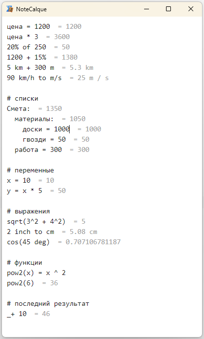
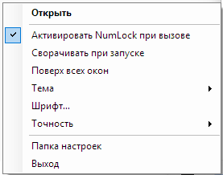

# NoteCalque

Текущая версия: **1.0.2.0**.

Калькулятор-блокнот в духе [calque.io](https://calque.io/index.html): слева многострочное поле с выражениями, справа результаты построчно. Живёт в трее, вызывается по **NumLock**, содержимое переживает закрытие.

Преемник Numlock Calculator (Vladimir Potapov, Karluk, www.keleg.info).

Разбором выражений занимается [math.js](https://github.com/josdejong/mathjs) 15.2.0 вместо собственного парсера.



## Изменения в 1.0.2.0

- Исправлены вызовы функций с переменными без цифр в строке: `sqrt(x)`,
  `abs(x)`, вложенные вызовы и функции с кириллическими именами.
- Вместо полного сообщения об ошибке в строке показывается «Ошибка»;
  подробности доступны при наведении на эту надпись.
- В меню трея добавлен «Автозапуск» при входе в Windows.
- Пункт с номером версии открывает [страницу проекта на GitHub](https://github.com/biospb/NoteCalque).

## Требования для запуска

Для запуска нужны Windows, .NET Framework 4.8 и установленный
**Microsoft Edge WebView2 Runtime**. WebView2 Runtime не входит в архив программы;
если он ещё не установлен, установите его перед запуском NoteCalque.

- [Скачать WebView2 Runtime с сайта Microsoft](https://developer.microsoft.com/microsoft-edge/webview2/#download-section).
- [Онлайн-установщик Evergreen Bootstrapper](https://go.microsoft.com/fwlink/p/?LinkId=2124703) — автоматически выбирает архитектуру и скачивает Runtime.
- Для установки без интернета выберите **Evergreen Standalone Installer**
  на странице Microsoft: **x64** для 64-битной Windows или **x86** для 32-битной.

## Что умеет

Результат стоит в той же строке, сразу за выражением, как на calque.io.

```
цена = 1200        = 1200
цена * 3           = 3600
20% of 250         = 50
1200 + 15%         = 1380
5 km + 300 m       = 5.3 km
90 km/h to m/s     = 25 m / s

Смета: = 800            ← строка, оканчивающаяся двоеточием, складывает
  материалы = 500       то, что под ней с большим отступом
  работа = 300
```

Переменные общие на весь текст. Результат предыдущей строки — `_`, он же
`last`, он же `ans`. Имена переменных можно писать кириллицей. Строки,
не похожие на выражение, результата не дают и не краснеют: это блокнот,
а не калькулятор.

Функции принимают переменные и результат предыдущей строки:

```text
x = 10       = 10
sqrt(x)      = 3.16227766017
sqrt(_)      = 1.77827941004
```

Если выражение не удалось вычислить, рядом появляется «Ошибка».
Наведите указатель на эту надпись, чтобы увидеть полное сообщение.

**Знак в начале пустой строки продолжает счёт.** Нажали `+`, `-`, `*`, `/`
или `^` в начале строки — перед знаком сам собой встаёт `_`:

```
10 / 3       = 3.33333333333
_*3          = 10
```

Подставляется имя, а не число. Число попало бы в строку уже округлённым до
выбранной точности, и продолжение счёта копило бы погрешность: `3.33333333333*3`
дало бы `9.99999999999`.

Имя выбрано не случайно: math.js принимает `_` как обычное имя переменной,
поэтому подменять что-либо в тексте не приходится. Знак вопроса на эту роль
не годится — в math.js он занят тернарным оператором.

**Tab и Shift+Tab** двигают отступ целых строк: всех, которых касается
выделение, или текущей. Отступы здесь не украшение — по ним считаются суммы
блоков.

## Настройки

Настройки находятся в меню значка NoteCalque в системном трее (systray).
Чтобы открыть меню, нажмите правой кнопкой мыши на значок рядом с часами.



В меню можно выбрать тему (системную, светлую или тёмную), шрифт области ввода
и точность результата, включить сворачивание при запуске и режим «Поверх всех окон».
Пункт «Автозапуск» включает запуск при входе в Windows для текущего пользователя.
Он создаёт запись `NoteCalque` в `HKCU\Software\Microsoft\Windows\CurrentVersion\Run`;
отключение удаляет эту запись. Если перенесли exe, выключите и снова включите
автозапуск, чтобы обновить путь. Пункт «NoteCalque 1.0.2.0» открывает страницу
проекта на GitHub.

Настройки запоминаются. Точность — в значащих цифрах, по умолчанию 12.

## Устройство

| Куда | Что |
|---|---|
| `Src\` | окно, трей, клавиатура, настройки — C#, WinForms, .NET Framework 4.8 |
| `Web\` | вёрстка и счёт — HTML и JS внутри WebView2 |
| `tests\` | тесты счётной части, запускаются в node |

Четыре файла в `Src\` перенесены из NoteCalc без изменений: `Win32.cs`,
`HotKey.cs`, `KeyboardHook.cs`, `PortableSettingsProvider.cs`. Каждый из них
несёт в заголовке объяснение, почему сделан именно так — там же перечислены
грабли, на которые уже наступили. Менять их, не прочитав эти заголовки, не
стоит.

Результат в строке держится так: поле ввода обычное и видимое, а поверх него
лежит слой, который повторяет каждую строку прозрачным текстом и дописывает
результат. Прозрачный двойник ставит результат ровно туда, где кончается
выражение, — ширину текста считать не приходится. Метрика поля и слоя обязана
совпадать до пикселя, поэтому шрифт, размер и высота строки заданы в одном
месте и приходят из настроек вместе.

**Программа — один файл.** Внутри exe лежат и страница с math.js, и обе сборки
WebView2, и нативный `WebView2Loader.dll`. Управляемые сборки подставляются
прямо из ресурсов через `AssemblyResolve` и на диск не попадают вовсе. Страница,
math.js и нативный загрузчик так не умеют: они раскладываются в
`%AppData%\NoteCalque\web` и `%AppData%\NoteCalque\native` при запуске — рядом
с exe их класть нельзя, каталог с программой может быть недоступен на запись.

Штатного способа собрать такое у пакета нет: `WebView2LoaderPreference=Static`
работает только для проектов на C++. Копирование библиотек в выходной каталог
отключают `ExcludeAssets=runtime` и `WebView2NeverCopyLoaderDllToOutputDirectory`,
а подстановку делает `Src\Program.cs`.

Настройки и содержимое блокнота — `%AppData%\NoteCalque\settings.xml`, путь
фиксированный и от версии сборки не зависит.

## Вызов по NumLock

Механизма два сразу, и это не избыточность: низкоуровневый хук
`WH_KEYBOARD_LL` и `RegisterHotKey`. Каждый поодиночке иногда молчит — хук
система снимает по `LowLevelHooksTimeout`, регистрацию хоткея может перехватить
чужая программа. Нажатие хук не глотает: оно идёт насквозь, состояние NumLock
честно переключается, а хук немедленно досылает встречное переключение.
Подробности — в заголовке `Src\KeyboardHook.cs`.

Крестик прячет окно в трей, а не закрывает программу: вместе с окном исчезли бы
хук и хоткей. Выход — из меню в трее.

Вторая копия не запускается: она обнаруживает работающую по именованному
мьютексу, просит её показаться и уходит. Молча закрыться тоже можно, но со
стороны это выглядит как будто программа не запустилась. Право поднять окно
на передний план вторая копия перед уходом передаёт первой — без этого окно
первой лишь мигнуло бы кнопкой в панели задач.

## Сборка

Открыть `NoteCalque.sln` в Visual Studio и собрать. Пакет `Microsoft.Web.WebView2`
восстанавливается сам. На машине нужен установленный **WebView2 Runtime**.

Developer Pack для .NET Framework 4.8 ставить не нужно: ссылочные сборки
приходят пакетом `Microsoft.NETFramework.ReferenceAssemblies.net48`, и без него
MSBuild падал бы с MSB3644. Из командной строки:

```
msbuild NoteCalque.csproj -t:Restore
msbuild NoteCalque.csproj -p:Configuration=Release
```

Тесты счётной части:

```
node tests\calc.test.js
```

## Лицензия

NoteCalque распространяется под **GNU GPL версии 3, только этой версии**
(SPDX: `GPL-3.0-only`). Полный текст — [LICENSE](LICENSE).

Программа содержит код Numlock Calculator (NoteCalc):
Copyright © 2009 Vladimir Potapov, Karluk, www.keleg.info.
Исходный проект опубликован под GNU GPL без указания номера версии;
в NoteCalque используется версия 3. Изменения NoteCalque — 2026, участники проекта.

Сторонние компоненты сохраняют свои лицензии:

- math.js 15.2.0 — Apache 2.0, Jos de Jong; текст в
  [Web/mathjs-LICENSE.txt](Web/mathjs-LICENSE.txt), уведомления встроенных
  компонентов — [Web/math.js.LICENSE.txt](Web/math.js.LICENSE.txt).
- WebView2 SDK 1.0.4191.47 — BSD 3-Clause, Microsoft;
  [лицензия](licenses/WebView2-LICENSE.txt) и
  [уведомления](licenses/WebView2-NOTICE.txt).

## Релиз

Архив для Windows содержит `NoteCalque.exe`, `NoteCalque.exe.config`, README
и лицензии. Распакуйте архив и запустите `NoteCalque.exe`.
Нужны .NET Framework 4.8 и установленный
[Microsoft Edge WebView2 Runtime](https://developer.microsoft.com/microsoft-edge/webview2/).
